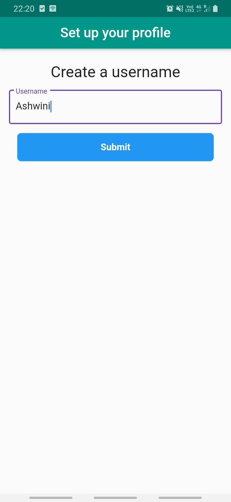
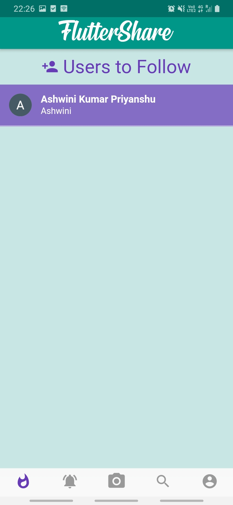
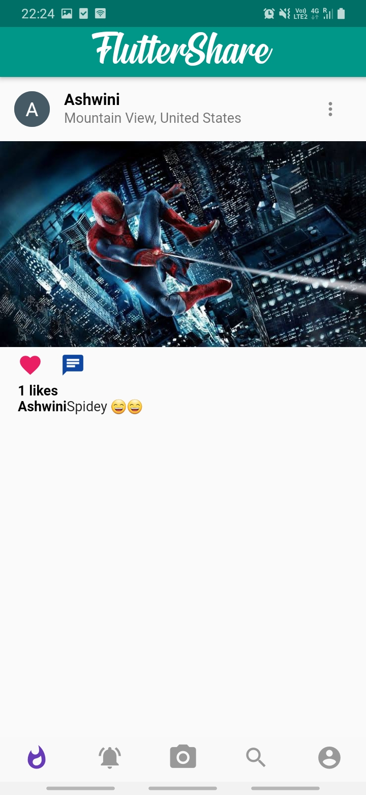
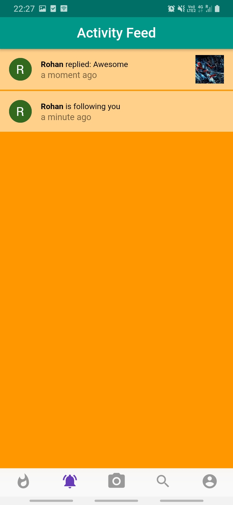
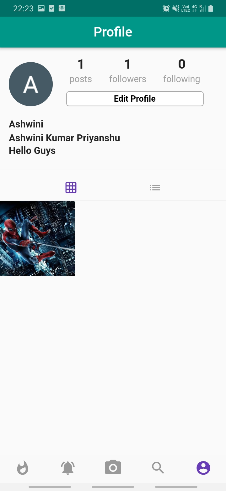
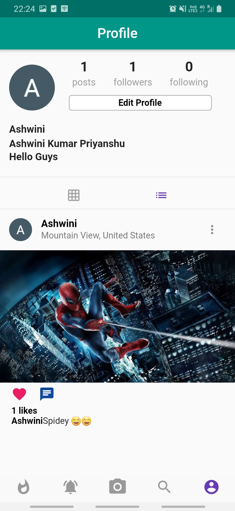
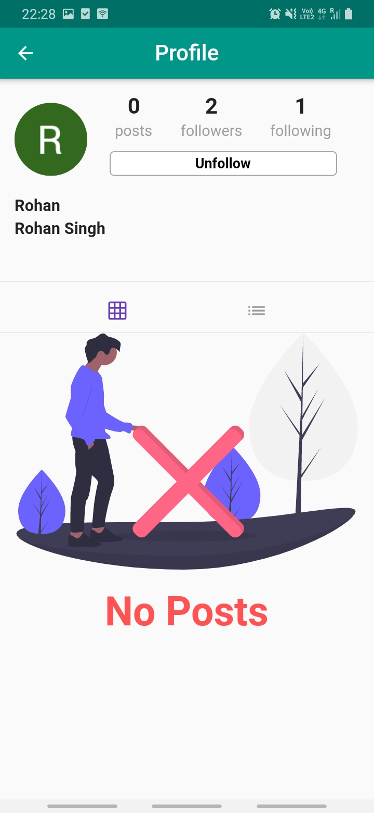
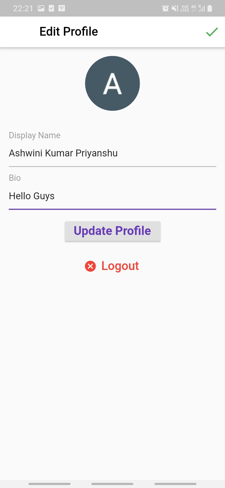

# FlutterShare:

This application basically uses firebase,firebase authentication,cloud firestore,firestore storage and live activity push notifications.

## ScreenShots:

 &nbsp;&nbsp;&nbsp;&nbsp;  &nbsp;&nbsp;&nbsp;&nbsp; &nbsp;&nbsp;&nbsp;&nbsp; 

 &nbsp;&nbsp;&nbsp;&nbsp;  &nbsp;&nbsp;&nbsp;&nbsp; &nbsp;&nbsp;&nbsp;&nbsp; 

 &nbsp;&nbsp;&nbsp;&nbsp;  &nbsp;&nbsp;&nbsp;&nbsp; &nbsp;&nbsp;&nbsp;&nbsp; 

 &nbsp;&nbsp;&nbsp;&nbsp;  &nbsp;&nbsp;&nbsp;&nbsp; &nbsp;&nbsp;&nbsp;&nbsp; 

## Features:

- google authentication is provided
- live push notifications for IOS and Android
- heartbeat animation during liking of post
- cloud firestore and firebase messaging is available
- follow,unfollow user and deleting post functionality is available
- uploading images using firebase storage is present
- search functionality for other users is available
- live activity feed notifications for user 

## Flutter Packages
Packages Name        | Usage       
:-------------------------|-------------------------
|[firebase_auth](https://pub.dev/packages/firebase_auth) | Authentication
|[google_sign_in](https://pub.dev/packages/firebase_storage)| Google Authentication
|[cloud_firestore](https://pub.dev/packages/cloud_firestore) | Live Messaging
|[firebase_storage](https://pub.dev/packages/firebase_storage)| Storing image in firebase
|[cached_network_image](https://pub.dev/packages/cached_network_image) | Show images from the internet
|[geolocator](https://pub.dev/packages/geolocator) | User's live location
|[time_ago](https://pub.dev/packages/time_ago) | Showing last moment
|[image_picker](https://pub.dev/packages/image_picker) | For picking image from device
|[animator](https://pub.dev/packages/animator) | Beautiful animations

## 🤝 Contributing
Contributions, issues and feature requests are welcome !
Feel free to check issues page.

